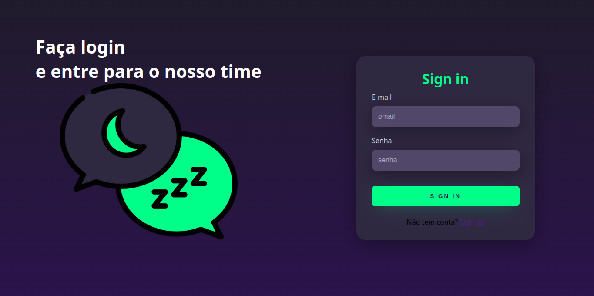
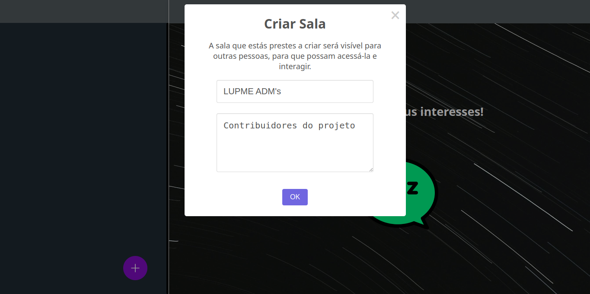
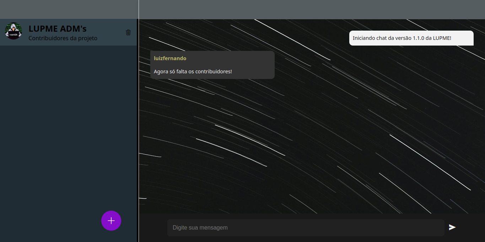

<h1 align="center">LUPME - Interaja com usuários de interesses comuns!</h1>
<p align="center">
  
  <a href="LICENSE" target="_blank">
    
  </a>
</p>

## Sumário 
- [Descrição](#descrição)
- [Funcionalidades](#funcionalidades)
- [Instalação](#instalação)
- [Configuração](#configuração)
- [Tecnologias Utilizadas](#tecnologias-utilizadas)
- [Contribuidores](#contribuidores)
- [Mostre seu apoio](#mostre-seu-apoio)

## Descrição
Bem-vindo a LUPME!

A LUPME é mais do que apenas uma plataforma de conexão - é um ecossistema digital projetado para unir pessoas com interesses peculiares em uma comunidade vibrante e acolhedora. Nossa missão é proporcionar um espaço onde você possa explorar suas paixões, compartilhar suas experiências e conectar-se com outros indivíduos que compartilham seus interesses únicos.

## Funcionalidades

- 🔐 Sign In: Faça login na plataforma para acessar recursos exclusivos e interagir com outros membros da comunidade.


- 📝 Sign Up: Registre-se e crie uma conta para se tornar parte da comunidade, compartilhar seus interesses e contribuir com discussões.


- 📚 Criar Fóruns: Crie e gerencie fóruns de discussão sobre uma variedade de tópicos para que os membros possam compartilhar ideias, experiências e conhecimentos.

- 🗑️ Excluir Fóruns: Como administrador ou moderador, remova fóruns ou tópicos que não estejam em conformidade com as diretrizes da comunidade.

- 🤝 Interagir com Pessoas: Conecte-se e interaja com outras pessoas que compartilham seus interesses, trocando mensagens, participando de discussões e colaborando em projetos.


- 🌟 Experiência Visual Imersiva: Desfrute de uma interface gráfica intuitiva e atraente para uma experiência visual envolvente enquanto navega pelos fóruns e interage com outros membros.

- 📄 Documentação Abrangente: Consulte nossa documentação abrangente para obter informações detalhadas sobre como usar a plataforma, diretrizes da comunidade e políticas de privacidade.

## Instalação
Para usar a LUPME localmente, basta clona o repositório usando:
```jsx
// Precisa-se ter o git instalado!
git clone https://github.com/luizfernandoin/LUPME.git
```
ou baixando um arquivo ZIP do código.

## Configuração
Aqui está um resumo de como configurar o aplicativo:

* **Passo 1** : Após clonar o repositório ou extrair o arquivo ZIP, navegue até o diretório raiz do projeto;
* **Passo 2** : No terminal, certifique-se de estar no diretório raiz do projeto;
* **Passo 3** : Ainda no terminal, verifique se possui o Python instalado, precisa-se dele;
* **Passo 4** : Crie um ambiente virtual para instalar as dependencias necessárias:
    ```jsx
        python -m venv .venv
    ```
    Agora é só ativar:
    ```jsx
        . .venv/bin/activate
    ```

* **Passo 5** : Instale as dependências do requirements.txt:
    ```jsx
        pip install -r requirements. txt
    ```

* **Passo 6** : Execute o programa através do seguinte comando:
    ```jsx
        python run.py
    ```


## Tecnologias Utilizadas
* Python
* Flask
* Socket IO
* JavaScript
* SweetAlert2
* HTML
* CSS


## Contribuidores

<table>
  <tbody>
    <tr>
      <td align="center" valign="top" width="25%"><a href="https://github.com/luizfernandoin"><br /><sub><b>Luiz Fernando</b></sub></a><br /><a href="https://github.com/luizfernandoin/NewSpace/commits?author=luizfernandoin" title="Documentation">💻</a></td>
    </tr>
  </tbody>
</table>

## Mostre seu apoio
Dê uma ⭐️ se este projeto ajudou você!